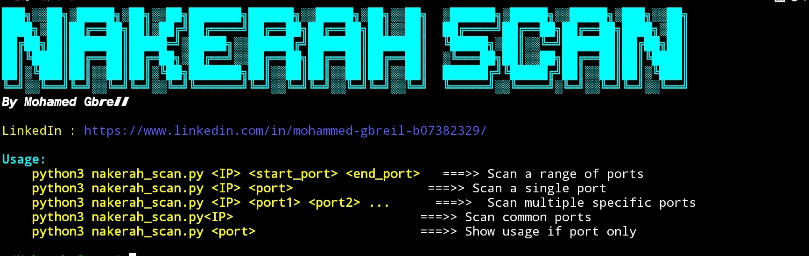

# Nakerah Scan

**Author:** Mohamed Gbreil  
[LinkedIn Profile](https://www.linkedin.com/in/mohammed-gbreil-b07382329/)

## Description

Nakerah Scan is a versatile and efficient tool designed for scanning ports on a given IP address or domain. With its user-friendly interface and robust features, it allows you to quickly identify open ports and gather essential information about the services running on them. Whether you need to scan a single port, a range of ports, or a list of specific ports, Nakerah Scan provides a straightforward and efficient solution.


## Features

- **Fast and Reliable Scanning**: Quickly scan for open ports on a target IP or domain.
- **Domain Resolution**: Automatically resolves domain names to IP addresses.
- **Flexible Port Scanning**: Scan a single port, a range of ports, or multiple specific ports.
- **Service Identification**: Identify the service running on open ports.
- **User-friendly Interface**: Clear and colorful output to enhance readability and user experience.
## Installation

To install and run **Nakerah Scan**, follow these steps:

### Linux 
   ```bash
   sudo apt update
   sudo apt install git
   sudo apt install python3
   git Clone https://github.com/0xgbreil/Nakerah_Scan.git
   cd Nakerah_Scan
   python3 nakerah_scan.py
```
## Usage

```bash
python3 nakerah_scan.py <IP> <start_port> <end_port>   # Scan a range of ports
python3 nakerah_scan.py <IP> <port>                  # Scan a single port
python3 nakerah_scan.py <IP> <port1> <port2> ...      # Scan multiple specific ports
python3 nakerah_scan.py <IP>                         # Scan common ports
python3 nakerah_scan.py <port>                      # Show usage if port only

